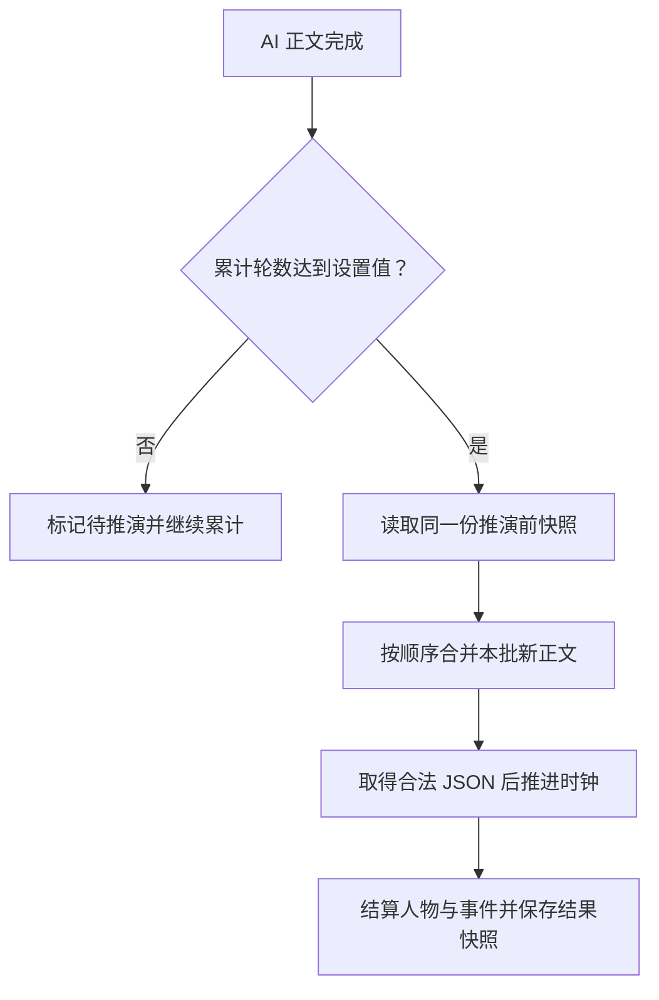
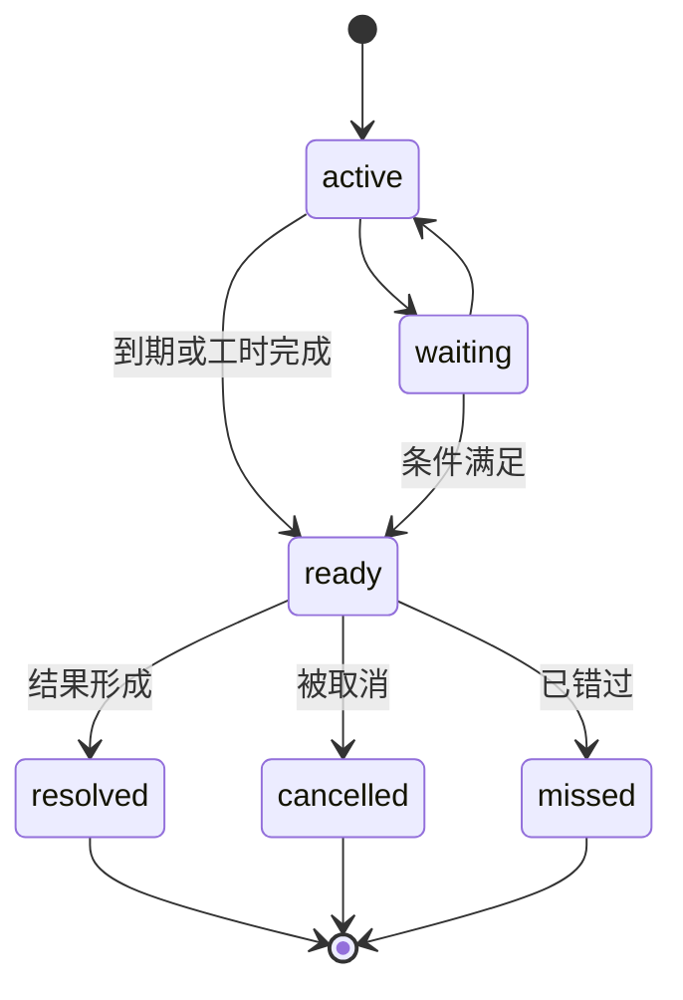

# 世界背面 0.5.1 架构说明

## 0.5.1 体验层

- 记忆页面使用界面本地的筛选、关键词和每类可见条数，不改变底层记忆账本；默认每类只创建 12 张卡片，用户主动点击后才继续扩展 DOM。
- 设置分组的展开状态、记忆筛选、搜索词和可见条数仅存在当前页面生命周期中，不写入聊天 metadata，也不污染重抽分支。
- `getSyncStatus` 汇总世界推演状态、记忆整理状态、尚未整理的 AI 正文数和短时撤销状态；界面选择最相关的活动任务展示。
- 手动操作撤销保存一次前态和当时的聊天/分支锚点，九秒内且锚点未变化时才能恢复；自动推演结果不进入该撤销栈。
- 面板关闭动画只延迟卸载 145ms，不延迟世界状态保存；系统开启“减少动画”时 CSS 会把动画时长压缩到近乎零。

## 0.5 新增链路

- 权威时间仍使用绝对分钟计算，`world.calendar` 额外保存历法名称和日期锚点；界面与提示统一通过 `formatWorldCalendar` 映射为年、月、日、时、分。
- `storyMemory.digest` 是不断改写的持续摘要，`storyMemory.facts` 是带版本关系的长期事实，`storyMemory.summaries` 是阶段经历，`storyMemory.clues` 是等待呼应或回收的伏笔。
- 自动记忆整理以尚未归档的 AI 正文条数计数，不以用户消息数或总楼层数代替。达到用户设置的 N 条后，仅整理新增区间。
- 同一事实键出现新值时保留旧版本；确定的新值会替代旧值，未证实的新值会让竞争说法并列进入争议态，明确否定则进入失效态。
- 世界推演和历史整理均可写入长期事实与伏笔；相关性召回综合实体标签、中文/文本二元片段、重要度、置信度和消息距离衰减。
- 正文注入是单独的安全出口，只允许 `known` 或 `direct` 的相关事实与线索通过；持续摘要、阶段经历、`hidden`/`trace` 内容不直接注入正文。
- 悬浮球根据世界推演状态和记忆整理状态切换运行类名，视觉动画不参与任何状态计算。

## 0.4 新增链路

- `api.js` 负责独立 OpenAI 兼容接口。`proxy` 模式只借用 SillyTavern 同源后端转发网络请求，URL、Key、模型与消息体均来自插件设置；`direct` 模式直接请求上游。
- `storyMemory.summaries` 保存分批历史摘要，`storyMemory.clues` 保存带消息楼层和 swipe 来源的伏笔。
- 历史建档按字符数与用户轮次分批，每批成功后写回聊天 metadata，支持断点续扫。
- 世界推演只召回与当前人物、地点和标签相关的少量摘要与伏笔。
- 人物即时观测复用所选 API，但不调用 `applySimulationResult`，因此不会写回状态或推进时钟。
- 自动调度可累计 N 条新 AI 正文后合并推演；旧轮次只提供因果上下文，只有标记为 `new="true"` 的正文会形成新变化。
- 后台 NPC 由插件端执行人数预算。入镜人物正常更新，镜头外人物按相关性限额推进，其余保持休眠。
- 临时请求或 JSON 失败可自动重试；所有尝试共享同一个 `base`，仅合法结果进入 `applySimulationResult`。

## 模块边界

“世界背面”管理可演算的当前世界状态，并维护当前聊天、当前重抽分支内的结构化长期记忆；它不跨聊天共享，也不保存逐字永久全文或人物全生平档案。

| 层 | 负责 | 不负责 |
|---|---|---|
| 主世界日历 | 权威绝对分钟、历法日期映射、校准与推进 | 现实时间同步 |
| 人物轨迹 | 位置、行动、短期意图、知识边界、当前独白 | 人物全生平记忆 |
| 事件账本 | 创建、计时、到期、结果、可见性、递交状态 | 自动替玩家决定行动 |
| 分支快照 | 每个 AI swipe 的推演前/后状态 | 合并互相矛盾的分支 |
| 分层记忆 | 持续摘要、长期事实版本、阶段经历、伏笔来源与相关性召回 | 跨聊天共享或逐字永久存档 |
| 正文注入 | 日历、相关状态、可自然显露的结果、角色可知的相关记忆 | 独白、完整后台账本、隐藏记忆 |
| 独立推演 | 从本批新 AI 正文抽取经过时间与状态变化 | 小说续写 |

## 时间模型

所有时间计算仍保存为从内部第 0 日 00:00 起算的绝对分钟：

```text
absoluteMinute = day × 1440 + hour × 60 + minute
```

`world.calendar` 保存一次历法日期与绝对分钟的锚定关系。展示日期由“锚定日期 + 绝对分钟差”得到，因此校准历法标签不会把事件误判成突然经过了许多年；真正推进仍只修改绝对分钟。

## 分层记忆模型

```text
持续摘要 digest
  ├─ 当前故事整体脉络，整理时重写
长期事实 facts
  ├─ active / disputed / superseded / invalidated
  └─ 每条保留 key、来源消息、swipe 与版本指针
阶段经历 summaries
  └─ 每个新增正文批次一段可追溯摘要
伏笔 clues
  └─ open / echoed / resolved / discarded
```

世界推演负责近场增量维护；按 N 条 AI 正文触发的记忆整理负责压缩较长区间和重写持续摘要。二者共享同一分支快照，但记忆整理不会推进世界时间。

达到自动触发频率后，模型只返回本批新正文中可确认的 `elapsed_minutes`。插件再用它推进时钟并结算事件。



没有明确经过时间时，`elapsed_minutes` 必须为 0。回复次数不参与任何进度公式。

## 事件状态



`ready` 事件不再显示在进行中列表。它等待后台给出明确结果；有结果后进入终态。

## 结果递交

事件结果和正文知情是两件不同的事：

1. 事件在后台形成结果。
2. 根据 `visibility` 进入候选队列。
3. 注入只提供少量候选结果。
4. 世界推演检查正文是否真的承接。
5. 只有被正文写到、感知到或留下可见痕迹，才标记 `delivered`。

非直接结果连续三次没有合适时机，会转入纪事，不再强塞正文；`direct` 结果会继续等待。

## 重抽快照

每个 AI swipe 保存：

- `base`：生成这条正文以前的世界；
- `result`：这条正文推演后的世界；
- `sourceKey`：消息号、swipe 号与正文哈希；
- `offeredEventIds`：生成前实际提供的候选结果；
- `status`：pending、committed 或 error。

新建 swipe 时恢复 `base`，而不是继承当前 swipe 的 `result`。切回旧 swipe 时恢复它自己的 `result`。

手动校时、手动建事件和导入状态会作为该分支锚点的覆盖快照保存，避免切换界面后消失。

## 第一视角独白

人物记录只保存当前独白和产生它的世界分钟：

```json
{
  "innerVoice": "我得在潮声停下以前把信藏好。",
  "innerVoiceAt": 4210
}
```

它会进入后台独立结算上下文，以便模型保持人物口吻并避免无意义重复；不会进入正文状态注入。不同 swipe 的快照各自保存自己的独白。

## 失败策略

- JSON 无法解析：保留 `base`，标记待推演；
- 中途切换聊天：不把旧聊天结果写入新聊天；
- 正文被编辑：编辑点及之后的快照全部标记过期；
- 后台模型不确定时间：保持 0 分钟；
- 手动把时钟向后校准：只校正当前时钟，不凭空撤销已经形成的结果；需要真正回滚时使用旧 swipe 或导入备份。
